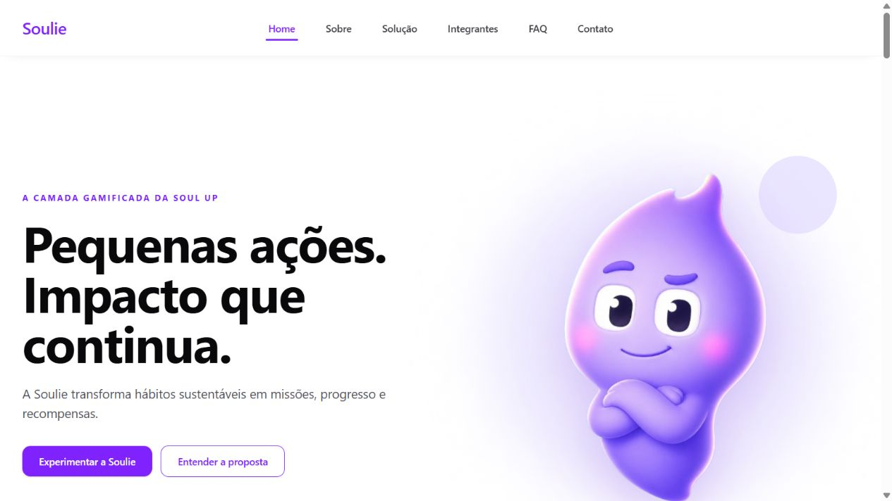
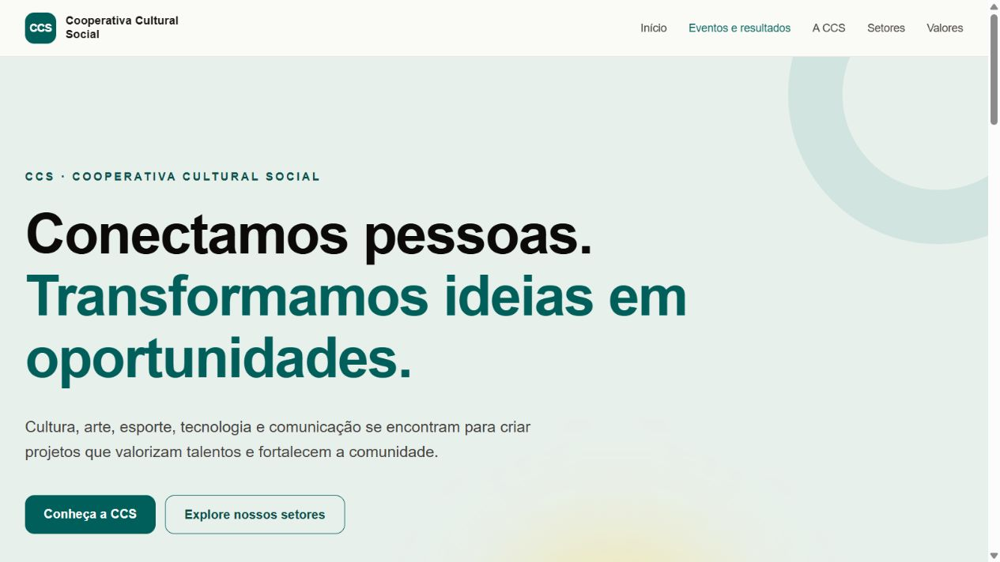

<strong>Language / Idioma</strong> · <a href="./README.md">🇧🇷 Português</a> · <strong>🇬🇧 English</strong>

<h1>Arthur Martins</h1>

<strong>Software Development Student | React · TypeScript · Java · Python</strong> São Paulo, Brazil

I build web applications and aim to turn real problems into clear, accessible, and well-structured solutions.

  
  

## About me

I am a Systems Analysis and Development student at FIAP. Before I start building, I like to understand the problem, the people who will use the solution, and the technical decisions involved.

My academic experience includes web interfaces, relational databases, software quality, and artificial intelligence. I improve through practical projects, teamwork, and clear documentation.

## Currently

- Building applications with **React, TypeScript, and Vite**.
- Studying **Java, Python, databases, and artificial intelligence**.
- Open to **software development internship opportunities** and collaborative projects.

## Featured projects

### [Soulie — a digital experience for SoulUp](https://github.com/arthurmartinss/soulie-sprint3)

  

`Academic team project` `React · TypeScript · Tailwind CSS`

An interactive application that encourages sustainable habits. **My contribution:** I implemented the team-member route, responsive menu, and click-based selection of Soulie's states.

  
  

### [Cooperativa Cultural Social](https://github.com/arthurmartinss/cooperativa-cultural-social)

  

`Academic project` `React · TypeScript` `Live site`

A website presenting the cooperative's departments, values, and activities. **My contribution:** I organized the initial structure, routes, pages, and shared components. The content is still evolving.

  
  

### [Acesso+ — Accessible Places Portal](https://github.com/1TDSPO-26/portal-locais-acessiveis)

`Academic team project` `QA and accessibility`

An accessible places portal in development. **My contribution:** I tested registration, editing, error messages, responsiveness, and keyboard navigation, with [documented scenarios and evidence](https://github.com/1TDSPO-26/portal-locais-acessiveis/pull/97).

## Technologies I use and study

<table align="center">
  <tr>
    <td align="center" width="50%"><strong>Front-end</strong>  </td>
    <td align="center" width="50%"><strong>Languages I'm studying</strong>  </td>
  </tr>
  <tr>
    <td align="center" width="50%"><strong>Database</strong>  </td>
    <td align="center" width="50%"><strong>Tools</strong>  </td>
  </tr>
</table>

## Languages

- **Portuguese:** native
- **English:** intermediate

## GitHub Stats

## Let's connect

I am interested in internship opportunities, collaborative projects, and conversations about software development, product, data, and artificial intelligence.

  
  

